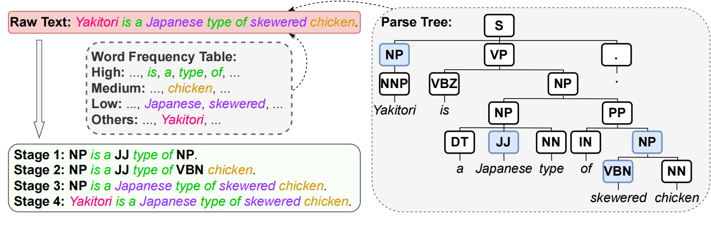

# BERT_CL

**Gradual Syntactic Label Replacement for Language Model Pre-training**



## Env installation
```
pip install benepar
pip install wordfreq
pip install transformers
pip install en_core_web_sm-2.3.0.tar.gz
```

## Parse the sentences in the corpus
- prepare model [benepar_en3](https://github.com/nikitakit/self-attentive-parser) in the ``fold benepar_en3/``

- cd ``./source`` and run ``python parse.py --inputs corpus.demo.txt --topn 500``.
    - the ``topn`` indicates the word frequency.
    - change the ``topn`` and get the corpus with syntatic replacement in different stages.


## Pre-training
We use the masked language modeling from huggingface transformers [run_mlm.py](https://github.com/huggingface/transformers/blob/main/examples/pytorch/language-modeling/run_mlm.py) for pre-training.

Note that we add the following syntactic labels to enlarge the vocabulary.

```
Labels = ['-LRB-', '-RRB-', 'ADJP', 'ADVP', 'CONJP', 'DT', 'EX', 'FRAG', 'FW', 'INTJ', 'JJ', 'JJR', 'JJS', 'LS', 'LST', 'NAC', 'NN', 'NNP', 'NNPS', 'NNS', 'NP', 'NX', 'PDT', 'POS', 'PRN', 'PRP', 'PRP$', 'PRT', 'QP', 'RBR', 'RBS', 'RP', 'RRC', 'SBAR', 'SBARQ', 'SINV', 'SQ', 'SYM', 'TOP', 'UCP', 'UH', 'VB', 'VBD', 'VBG', 'VBN', 'VBP', 'VBZ', 'WDT', 'WHADJP', 'WHADVP', 'WHNP', 'WHPP', 'WP', 'WP$', 'WRB']
tokenizer_kwarg={"additional_special_tokens":Labels}
tokenizer=AutoTokenizer.from_pretrained(tokenizer_name,**tokenizer_kwarg)
model=AutoModelForMaskedLM.from_pretrained(model_name)
model.resize_token_embeddings(len(tokenizer))
```
## Citation

```bibtex
@ARTICLE{10315017,
  author={Wang, Yile and Zhang, Yue and Li, Peng and Liu, Yang},
  journal={IEEE/ACM Transactions on Audio, Speech, and Language Processing}, 
  title={Gradual Syntactic Label Replacement for Language Model Pre-Training}, 
  year={2024},
  volume={32},
  number={},
  pages={486-496},
  doi={10.1109/TASLP.2023.3331096}}
```

